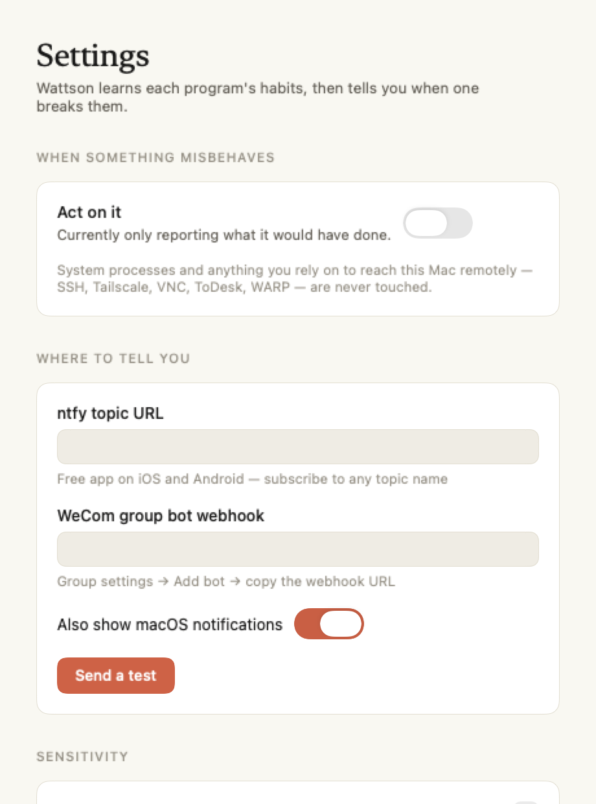

# Wattson

**Every process monitor on macOS tells you which program is using the most CPU.
None of them tell you whether it should be.**

Wattson learns what each program on your Mac normally does — over months, not
minutes — and notices when one stops behaving like itself.

<p align="center">
  
</p>

A full monitor and a watchdog in one: CPU, memory, battery, network and disk at
the depth you would expect from a system monitor — plus the thing no monitor
does, which is knowing what "normal" looks like for each program and telling you
when one departs from it.

Native look in both appearances, English and 简体中文, no configuration to get
started. [中文说明](README.zh-CN.md)

```
04:46:40  [demoted] verge-mihomo [92561] score 0.65
          CPU 100% vs its 47-day norm of 1.5%
          network throughput collapsed to 0% of normal
          stopped making syscalls while pegging the CPU
          → moved to efficiency cores
          stack sample: verge-mihomo-92561-2026-09-06T04-46-40.txt
```

## The problem

You leave your Mac at home running something long — a build, an agent, a
training job — and come back to a machine that has been at 90°C for nine hours
because some background daemon wedged itself in a loop at 11am.

Existing tools do not help with this, and it is worth being precise about why.
App Tamer, CPU Cap, OpenTamer and friends all work the same way: *"if process X
goes above N%, throttle it."* That rule is useless here, because on a machine
doing real work the runaway process and the useful one look identical:

| | CPU | Should you kill it? |
|---|---|---|
| Codex compiling for 20 minutes | 100% | No — that's the job |
| Clash wedged in a DNS loop | 100% | Yes — it's been broken since 11am |

A fixed threshold cannot separate these. So you either set it so high it never
fires, or you throttle your own work.

## The idea

Don't ask *how much* CPU a process is using. Ask whether **this** program has
ever used CPU **this way before**.

That question has an answer, and the answer is different for every program:

| Program's history | Typical | Spread | Sees 100% today | Verdict |
|---|---|---|---|---|
| A proxy daemon, always quiet | 1.5% | tiny | wildly out of character | **flagged** |
| A browser, naturally spiky | 30% | wide | seen it a hundred times | ignored |
| A renderer, always maxed | 95% | tiny | that's just Tuesday | ignored |

wattson keeps a per-program behavioural baseline and scores each observation
against that program's own history. Nothing to configure, no allowlist to
maintain, no thresholds to guess. The programs that are supposed to be hot stay
hot.

### Long memory, on purpose

Baselines are two-tier: a high-resolution rolling window for the last few hours,
plus one compressed summary **per program per day, kept for 90 days**.

This is not a detail. A short rolling window is dragged upward by an episode
that lasts longer than the window itself — a process wedged since yesterday
gradually *becomes* its own new normal and stops being reported, which is
precisely the failure mode that matters when you are away for a week. A window
built from daily medians cannot be moved by one bad day.

### Level is not enough — duration counts too

A browser's CPU is naturally spiky, so its spread is wide and a genuine wedge
can hide inside the noise. But every program still has a longest-episode-ever.
Twenty minutes at 100% is a compiler being a compiler; twenty minutes at 100%
from something that has never exceeded thirty seconds in three months is not.

## What it deliberately does not do

It does not judge whether a computation is *useful*. That is not decidable, and
measurements say so plainly. Here are two processes on a real machine — one in
an infinite empty loop, one doing actual arithmetic:

```
COMMAND              CPU%   SYSCALL/cpus    IPC
Python (spin loop)   99.9              0   8.06
Python (real math)   99.9              0   8.22
```

Indistinguishable, and they always will be. Any tool claiming to detect "wasted"
CPU from hardware counters is guessing. wattson detects something weaker but
real: a **regime change**. Not "this work is pointless" but "this program is not
acting like itself."

## The escalation ladder

Interventions are ordered so the gentlest one that could work is tried first.

**1. Demote to efficiency cores** (`taskpolicy -b`). On Apple Silicon this
confines the process to the E-cores. Measured on an M5:

```
normal priority     4381 Miter/s
taskpolicy -b        180 Miter/s     ← 24x slower
taskpolicy -B       4367 Miter/s     ← fully restored
```

A 24x cut in throughput, and the process keeps running, keeps its connections,
loses no state, and is restored the moment it behaves again. This is a supported
macOS mechanism — the same one the system uses to keep background work off the
performance cores — not a trick.

**2. Restart**, only if demotion hasn't settled it after several minutes, and at
most twice an hour. Anything supervised comes back clean.

Before intervening, wattson runs `sample` on the process and saves the stack.
The difference between *"Clash used a lot of CPU while you were out"* and
*"Clash was wedged in this exact call"* is evidence that no longer exists by the
time you get home — unless something captured it.

## Lifelines: what it will never touch

This is the part that makes it safe to leave running while you are away.

- **System-critical processes.** Interfering degrades or panics macOS.
- **Your way back in** — `sshd`, Tailscale, VNC, ToDesk, TeamViewer, AnyDesk,
  WireGuard, Cloudflare WARP. A watchdog that decides your VPN daemon is
  misbehaving and suspends it has locked you out of the machine it was supposed
  to be protecting, from wherever you happen to be standing.

These are never demoted, never restarted, never scored. Add your own in
`neverTouch`.

**It also starts in observe-only mode.** For the first days it reports what it
*would* have done and changes nothing. Set `"dryRun": false` once the verdicts
look right to you.

## What it shows

| | |
|---|---|
|  | **CPU** — busy/user/system split, load history, and per-core load with the efficiency and performance clusters separated. That split matters here: confining a process to the E-cores is the first thing Wattson does about a runaway, so you can watch the intervention work. |
|  | **Battery** — charge, health against design capacity, cycle count, voltage, current, draw, and **temperature with its own history**. Lithium packs age fastest when held hot, and a process stuck at full CPU while you are away keeps the pack warm for hours. That is the damage this app exists to prevent, so the record of it is a first-class page. |
|  | **Memory** — real pressure level from the kernel, split into app / wired / compressed / free, with swap and the largest resident processes. |
|  | **History** — every program's learned baseline: usual CPU, spread, peak, longest hot run, usual network and syscall rates, and a bar per day with today marked against it. This is the evidence behind every judgement the app makes. |

Everything above comes from stock `top`, `nettop`, `sysctl` and the IO registry.
No root, no kernel extension, no helper daemon.

## Settings

<p align="center">
  
</p>

Notifications go to macOS Notification Centre and, optionally, to
[ntfy](https://ntfy.sh) (free app on iOS and Android — subscribe to any topic
name) or a WeCom group bot webhook. Both are just a URL.

## Install

Requires macOS 13+. Apple Silicon recommended: E-core demotion is what makes the
gentle intervention possible, and on Intel it degrades to priority reduction.

```sh
git clone https://github.com/BabyChemZ/wattson
cd wattson
./scripts/build-app.sh
cp -r dist/Wattson.app /Applications/
open /Applications/Wattson.app
```

Then turn on **Start at login** in Settings. No Xcode needed — the bundle is
assembled by SwiftPM and a shell script.

No root, no kernel extension, no TCC prompt. Every measurement comes from stock
`top` and `nettop`, which is a deliberate constraint: a watchdog you have to
grant privileges to is a watchdog most people never install.

## Command line

The same binary is also a CLI, which is the fastest way to see the engine's
reasoning:

```sh
wattson top                    # every process right now, as the engine sees it
wattson status                 # what has been learned about each program
wattson explain verge-mihomo   # one program's baseline in detail
wattson watch                  # run the watchdog in the foreground
wattson install                # run at login without the UI
```

```
COMMAND               CPU%   USUAL   SYSCALL/s    NET B/s    IPC  VERDICT
verge-mihomo         402.1     1.5           0          0   1.10  ANOMALOUS — CPU 402% vs its 47-day norm of 1.5%
Codex (Service)      118.3    96.2       24573          0   0.96
WindowServer          34.6       -       33343          0   1.33  protected (system-critical)
CloudflareWARP         0.5       -       48883          0   1.03  protected (remote-access lifeline)
```

## Signals

All per-process, all sudo-free, sampled every 30s:

| Signal | Source | What a change means |
|---|---|---|
| CPU time | `top` TIME, differenced | the gate — must be unusual *for this program* |
| Network bytes | `nettop -P` | a proxy that stopped moving bytes is wedged, not busy |
| Syscalls | `top` SYSMACH+SYSBSD | pegging a core without touching the kernel = user-space spin |
| Instructions / cycles | `top` INSTRS, CYCLES | IPC shifts in *either* direction: tight loops run it up, lock contention runs it down |
| Episode duration | measured | hot for longer than it has ever been hot |
| Idle wakeups | `top` IDLEW | timer storms and polling loops |

Statistics use median and MAD rather than mean and standard deviation
throughout, because the events being detected are extreme outliers and a mean
would let one runaway episode poison the very baseline it is judged against.

## Config

`~/.wattson/config.json`, created on first run. Notifications go to macOS
Notification Centre, and optionally to [ntfy](https://ntfy.sh) or a WeCom group
bot webhook — both just a URL.

## License

MIT
