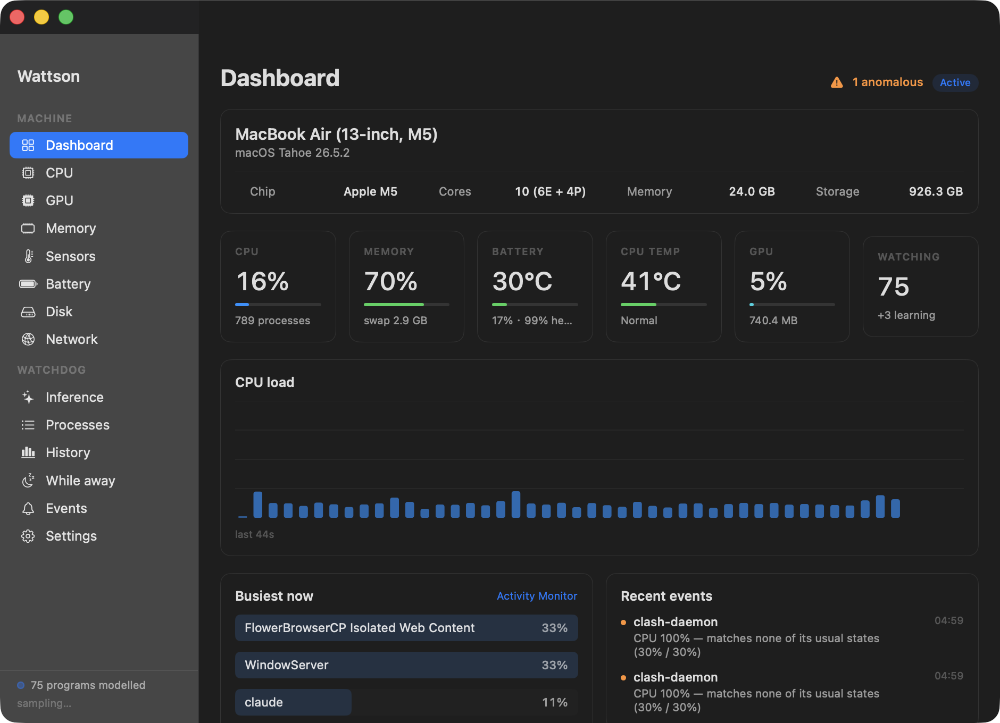
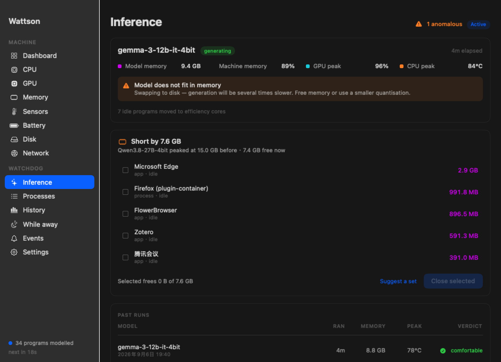
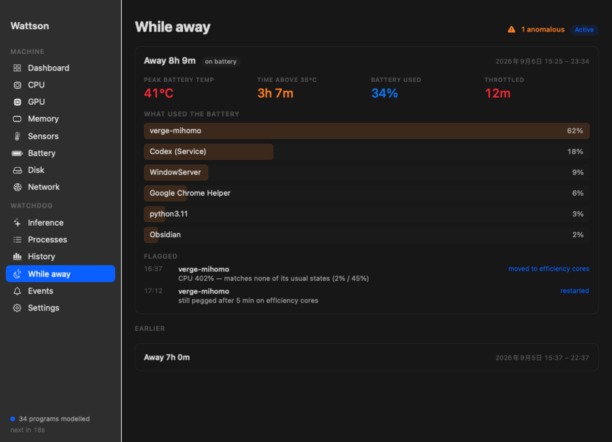
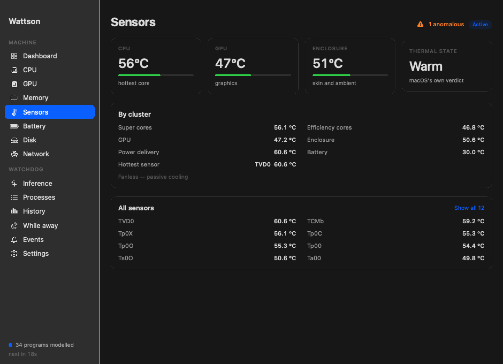
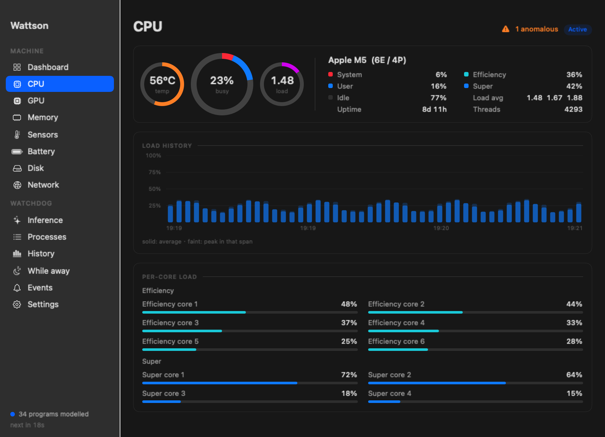
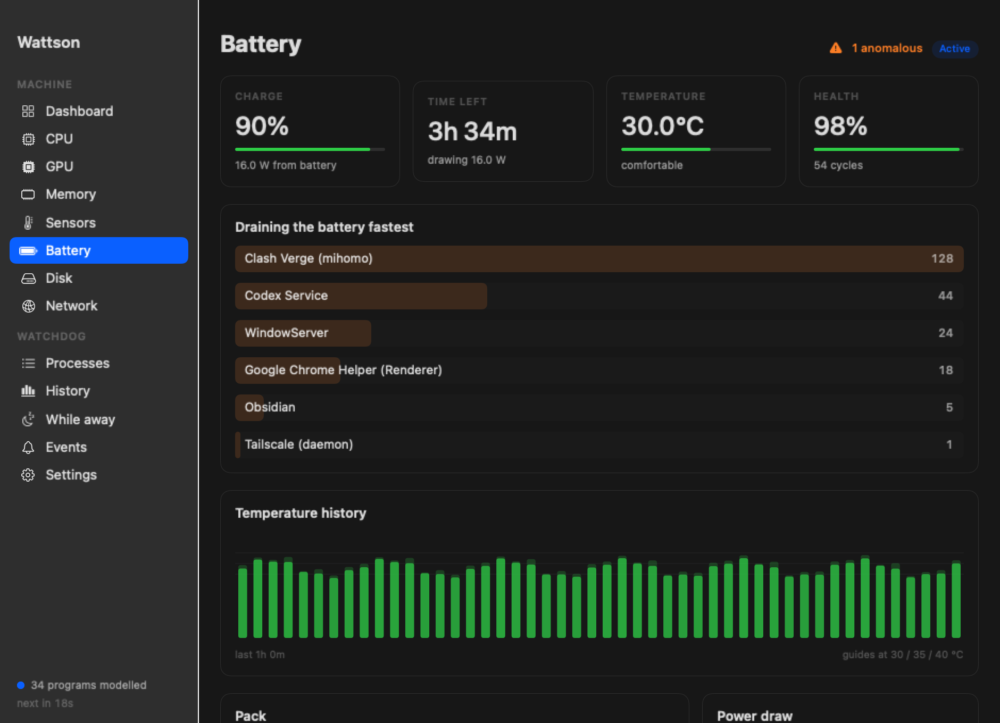
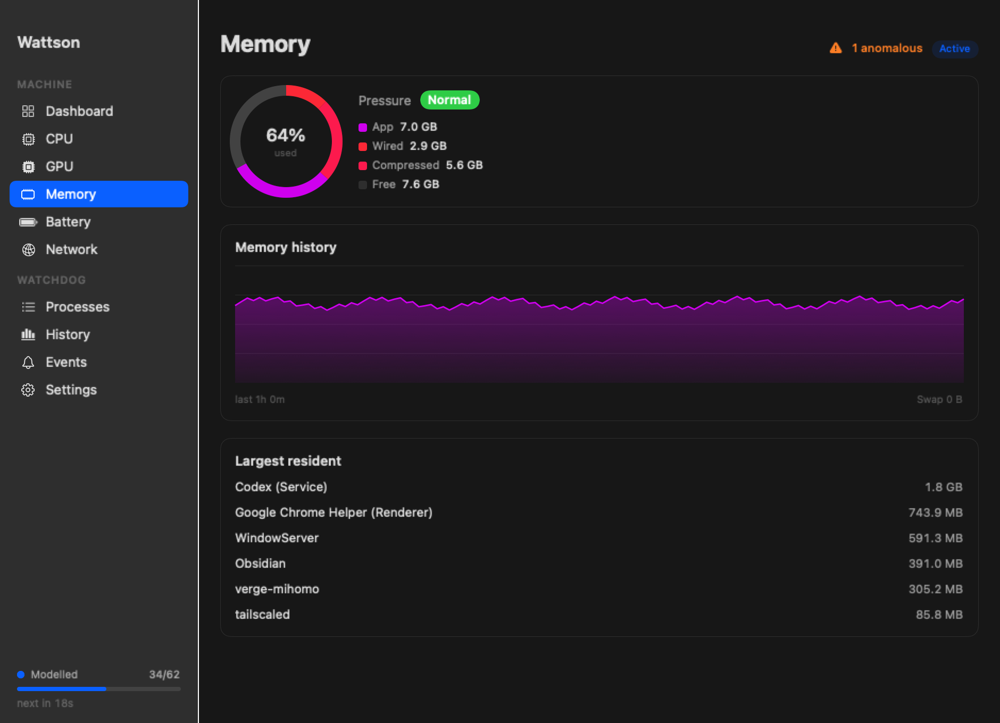
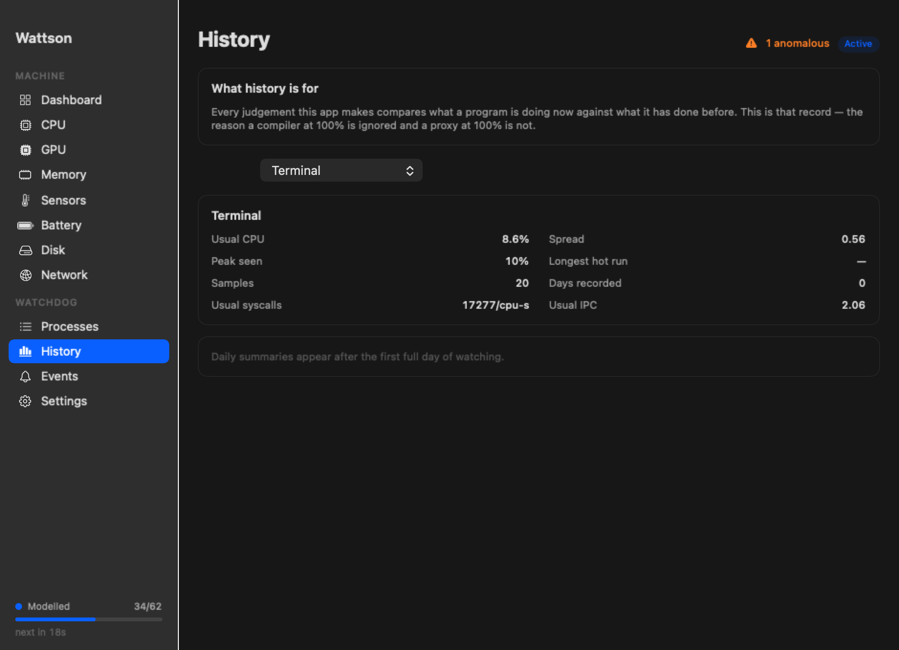

<p align="center">
  
</p>

<h1 align="center">Wattson</h1>

<p align="center">
  <b>A Mac monitor that learns what <i>normal</i> looks like for every program —<br>
  and a watchdog that acts on it while you're away.</b>
</p>

<p align="center">
  
  
  
  
  
</p>

<p align="center">
  English · <a href="README.zh-CN.md">简体中文</a>
</p>

<p align="center">
  
</p>

---

## Why

Every process monitor tells you which program is using the most CPU. **None can
tell you whether it should be.**

You leave the Mac running something long and come back to a machine that has
been at 90°C for nine hours, because a background daemon wedged itself in a
loop at 11am. A threshold can't catch that — on a machine doing real work, the
runaway and the useful process look identical:

<table>
<tr><td width="50%">

**A compiler, mid-build**<br>
`100% CPU` · leave it alone

</td><td width="50%">

**A proxy in a DNS loop**<br>
`100% CPU` · broken since 11am

</td></tr>
</table>

## The idea

> Don't ask *how much* CPU a program is using.
> Ask whether **this** program has ever used CPU **this way** before.

Baselines are **clustered, not averaged** — most programs have several honest
modes. An editor idles near zero and compiles near a full core; a single median
lands in the empty gap between them and calls both states abnormal. On this
machine, **43 of 45** modelled programs turned out to have more than one normal.

| Program's history | Sees 100% today | Verdict |
|:---|:---|:---|
| A proxy, always quiet | wildly out of character | 🔴 **flagged** |
| A browser, naturally spiky | seen it a hundred times | ⚪ ignored |
| A renderer, always maxed | that's just Tuesday | ⚪ ignored |

Memory is two-tier — a rolling window for recent hours, plus **one summary per
program per day, kept 90 days**. A short window is dragged upward by an episode
that outlasts it, so a process wedged since yesterday would gradually *become*
its own new normal. Which is exactly the failure that matters when you're away
for a week.

---

## Built for agents and local models

This is where the baseline earns its keep, because these workloads fail in ways
ordinary software doesn't.

<table>
<tr>
<td width="45%"></td>
<td>

### 🧠 Model inference

Runs followed end to end — runtime and model identified, phase inferred from
behaviour, peak memory, GPU, temperature, throttling and swap recorded.

Past runs get a **verdict**: `comfortable` · `throttled` · `didn't fit`.

That column answers the question you actually have before downloading seven
gigabytes — and answers it *from your machine*, not a benchmark table.

</td>
</tr>
<tr>
<td></td>
<td>

### 🌙 While you were away

A session opens when the keyboard goes quiet and closes when you're back: peak
battery temperature, minutes above 35 °C, charge consumed, throttling — and
**Energy Impact integrated per program** across the whole session.

Instantaneous energy says who's costly *now*. Integrated over eight hours it
says who actually drained the battery. Usually a different answer.

</td>
</tr>
<tr>
<td></td>
<td>

### 🌡 Sensors

**116 temperature sensors** read straight from the SMC, grouped by what they
measure — performance cores, efficiency cores, GPU, enclosure, power delivery.

Each group is reported by its *hottest* member, since that's the one that
decides when the system throttles.

</td>
</tr>
</table>

<details>
<summary><b>🧹 Agent leftovers</b> — processes an agent started and walked away from</summary>

<br>

Close a program and it's gone. An agent's test runner or dev server **outlives
the session that spawned it**, with no window to close and nothing in the loop
responsible for tidying up.

Processes are attributed by walking the process tree — a leftover `node` says
nothing about its origin, but its ancestry does. Reported by name: what it is,
which agent left it, how long it's been stranded, and a button to quit it.

The test that keeps this honest: only processes **reparented to launchd** count.
A child still held by a live parent is already somebody's responsibility.

</details>

<details>
<summary><b>💾 Making room</b> — what to close so a model fits</summary>

<br>

Standing programs down onto the efficiency cores frees **no memory at all**,
which is most of what matters when a model doesn't fit.

No user-space program can release another's memory — `purge` needs root and
only touches disk caches, `memory_pressure` *allocates* rather than reclaims,
and there's no API to make a process yield. **Closing it is the only way.**

So Wattson does the part it can: which applications are genuinely idle, what
each is holding, and how many it takes to clear the shortfall — grouped by the
app that owns them, because closing one browser renderer does nothing.

</details>

---

## What it shows

<table>
<tr>
<td width="50%"></td>
<td width="50%"></td>
</tr>
<tr>
<td>

**CPU** — busy/user/system split, load history with peaks preserved, per-core
load with efficiency and performance clusters separated, **per-cluster clock
speed** from IOReport, load averages, uptime.

</td>
<td>

**Battery** — charge, health against design capacity, cycles, voltage, current,
draw, and **temperature with its own history**. Sustained heat is what ages a
pack.

</td>
</tr>
<tr>
<td></td>
<td></td>
</tr>
<tr>
<td>

**Memory** — real pressure level from the kernel, split app / wired /
compressed / free, swap, and the largest resident applications.

</td>
<td>

**History** — each program's learned baseline: usual CPU, spread, peak, longest
hot run, usual network and syscall rates, a bar per day with today marked
against it.

</td>
</tr>
</table>

Everything comes from stock `top`, `nettop`, `sysctl`, the IO registry, the SMC
and IOReport. **No root, no kernel extension, no helper daemon.** Hover any
chart to name the column — average, peak, and the time it covers.

---

## The escalation ladder

Gentlest first.

**1 · Demote to efficiency cores** — `taskpolicy -b`. Measured on an M5:

```
normal priority     4381 Miter/s
taskpolicy -b        180 Miter/s     ← 24× slower
taskpolicy -B       4367 Miter/s     ← fully restored
```

The process keeps running, keeps its connections, loses no state, and is
restored the moment it behaves again.

**2 · Restart** — only if demotion hasn't settled it after several minutes, and
at most twice an hour.

Before intervening, `sample` is run and the stack saved. The difference between
*"Clash used a lot of CPU while you were out"* and *"Clash was wedged in this
exact call"* is evidence that no longer exists by the time you get home.

### 🛟 Lifelines

Never touched, under any circumstances:

- **System-critical processes** — interfering degrades or panics macOS
- **Your way back in** — `sshd`, Tailscale, VNC, ToDesk, TeamViewer, AnyDesk,
  WireGuard, Cloudflare WARP

> A watchdog that suspends your VPN has locked you out of the machine it was
> protecting.

It also **starts in observe-only mode**, and never acts on a program that
doesn't have a baseline yet.

---

## What it deliberately doesn't do

It does not judge whether a computation is *useful*. That isn't decidable, and
the measurements say so plainly — two processes, one in an infinite empty loop,
one doing real arithmetic:

```
COMMAND              CPU%   SYSCALL/cpus    IPC
Python (spin loop)   99.9              0   8.06
Python (real math)   99.9              0   8.22
```

Indistinguishable, and always will be. Wattson detects a **regime change** —
not *"this work is pointless"* but *"this program is not acting like itself."*

---

## Install

```sh
git clone https://github.com/BabyChemZ/wattson
cd wattson
./scripts/build-app.sh
cp -r dist/Wattson.app /Applications/
open /Applications/Wattson.app
```

No Xcode needed — SwiftPM builds the binary, a shell script assembles the
bundle. Then turn on **Start at login** in Settings.

<details>
<summary>Downloaded a release archive instead?</summary>

<br>

The build is unsigned, so a downloaded copy is quarantined:

```sh
xattr -dr com.apple.quarantine /Applications/Wattson.app
```

Building it yourself avoids this entirely.

</details>

### Command line

The same binary is a CLI:

```sh
wattson top                    # every process as the engine sees it
wattson status                 # what's been learned about each program
wattson explain verge-mihomo   # one program's baseline in detail
wattson sensors                # every temperature sensor
wattson watch                  # run the watchdog in the foreground
```

---

## Honest limitations

- **Events are rare, by design.** macOS is stable — a well-behaved machine may
  go weeks with nothing flagged. That's the good outcome, but it means the
  watchdog is insurance; day to day, the value is in the monitoring and the
  inference and agent work.
- **Tested on one machine** — M5 MacBook Air, 24 GB, macOS 26. Intel is
  untested and parts won't work there.
- **Unsigned** — notarisation needs a paid developer account.
- **No automated tests yet.**

---

<p align="center">
  <sub>MIT · Built for a Mac that's often left running alone.</sub>
</p>
