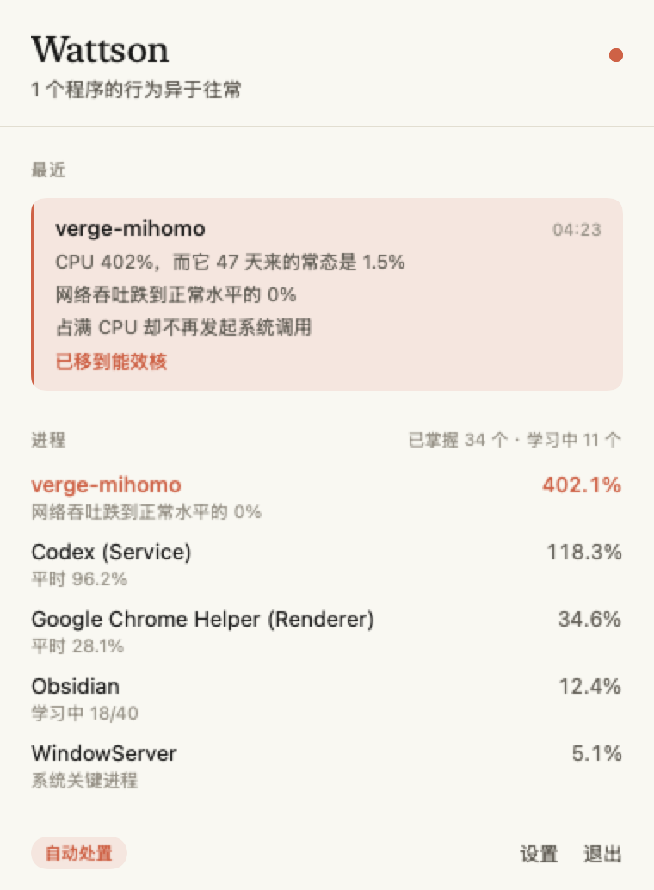

# Wattson

**macOS 上所有的进程监控都能告诉你谁最占 CPU，但没有一个能告诉你它「该不该」占。**

Wattson 会学习你 Mac 上每个程序的日常行为——按月计，不是按分钟——然后在某个程序开始「不像它自己」时告诉你。

<p align="center">
  
</p>

## 它解决什么问题

你出门时让 Mac 挂着跑长任务——编译、agent、训练。回来发现机器已经 90 度烧了九个小时，因为某个后台守护进程在上午十一点卡进了死循环。

现有工具帮不上，原因很具体：App Tamer、CPU Cap、OpenTamer 全都是同一个逻辑——「进程 X 超过 N% 就限制它」。这条规则在这里是废的，因为在一台真在干活的机器上，跑飞的进程和有用的进程长得一模一样：

| | CPU | 该杀吗 |
|---|---|---|
| Codex 编译了 20 分钟 | 100% | 不该——这就是它的工作 |
| Clash 卡在 DNS 死循环 | 100% | 该——它从上午就坏了 |

固定阈值分不开这两者。你要么把它设得高到永不触发，要么就掐掉自己的活。

## 思路

不要问一个进程用了**多少** CPU。要问**这个**程序以前**这样**用过 CPU 吗。

这个问题有答案，而且每个程序的答案都不一样：

| 程序的历史 | 常态 | 波动 | 今天看到 100% | 判定 |
|---|---|---|---|---|
| 代理守护进程，一贯安静 | 1.5% | 极小 | 完全不像它 | **报警** |
| 浏览器，天生忽高忽低 | 30% | 很大 | 见过一百次了 | 忽略 |
| 渲染进程，一直满载 | 95% | 极小 | 周二就这样 | 忽略 |

Wattson 为每个程序维护一份行为基线，拿每次观测和这个程序自己的历史比。不需要配置，不需要维护白名单，不需要猜阈值。该热的程序继续热。

### 长期记忆是刻意的

基线分两层：最近几小时的高分辨率滚动窗口，加上**每个程序每天一条摘要、保留 90 天**。

这不是细节。短窗口会被比窗口本身还长的异常拖上去——一个从昨天就卡住的进程会慢慢**变成**它自己的新常态，然后就再也报不出来了，而这恰恰是你离家一周时最要命的失效方式。由每日中位数构成的窗口，不会被糟糕的一天拉动。

### 光看高度不够，还要看时长

浏览器的 CPU 天生忽高忽低，波动大，真卡死了也可能藏在噪声里。但每个程序都有一个「有史以来最长的一次」。20 分钟 100% 对编译器来说是本职工作；对一个三个月来从没超过 30 秒的程序来说不是。

## 它刻意不做的事

它不判断一段计算是否「有用」。那是不可判定的，而且测量数据说得很直白。下面是真机上的两个进程，一个在无限空循环，一个在做真实运算：

```
COMMAND              CPU%   SYSCALL/cpus    IPC
Python（空转死循环） 99.9              0   8.06
Python（真实运算）   99.9              0   8.22
```

无法区分，而且永远无法区分。任何声称能从硬件计数器识别「被浪费的 CPU」的工具都是在猜。Wattson 检测的是一件更弱但真实的事：**行为突变**。不是「这活儿没意义」，而是「这程序不像它自己了」。

## 处置阶梯

按「能用最轻的手段就用最轻的」排序。

**1. 移到能效核**（`taskpolicy -b`）。在 Apple Silicon 上这会把进程限制在能效核。M5 实测：

```
正常优先级       4381 Miter/s
taskpolicy -b     180 Miter/s     ← 慢 24 倍
taskpolicy -B    4367 Miter/s     ← 完全恢复
```

吞吐掉了 24 倍，而进程还活着、连接还在、状态没丢，一旦它恢复正常就立刻还原。这是 macOS 支持的机制——系统自己就用它把后台工作挡在性能核之外——不是什么歪招。

**2. 重启**，只在降核几分钟仍未平息时执行，且每小时最多两次。有监管的进程会干净地回来。

处置之前，Wattson 会对进程跑 `sample` 抓下调用栈。「Clash 在你不在时占了很多 CPU」和「Clash 卡死在这个具体的调用上」之间的差别，是一份等你到家就不存在了的证据——除非有东西当场把它留下来。

## 生命线：它永远不碰的东西

这是它可以放心挂在无人值守机器上的原因。

- **系统关键进程**。干预会让 macOS 降级甚至内核崩溃。
- **你回家的路**——`sshd`、Tailscale、VNC、ToDesk、TeamViewer、AnyDesk、WireGuard、Cloudflare WARP。一个守护进程如果判定你的 VPN 有问题并把它挂起，那它就把你锁在了它本该保护的那台机器外面——不管你当时人在哪里。

这些永不降核、永不重启、根本不参与评分。你可以在 `neverTouch` 里加自己的。

**而且它默认只观察。** 最初几天它只报告「本来会做什么」，什么都不改。等你觉得判断靠谱了，再在设置里打开「自动处置」。

## 安装

需要 macOS 13+。推荐 Apple Silicon：降到能效核这个温和手段依赖它，Intel 上会退化成单纯降低优先级。

```sh
git clone https://github.com/BabyChemZ/wattson
cd wattson
./scripts/build-app.sh
cp -r dist/Wattson.app /Applications/
open /Applications/Wattson.app
```

然后在设置里打开「登录时启动」。不需要 Xcode。

不需要 root，不需要内核扩展，不需要任何授权弹窗。所有测量都来自系统自带的 `top` 和 `nettop`——这是刻意的约束：一个需要你授予特权的守护工具，大多数人根本不会装。

## 通知

macOS 通知中心，以及可选的 [ntfy](https://ntfy.sh)（iOS 和安卓都有免费 App，订阅任意主题名）或企业微信群机器人 Webhook。都只需要一个 URL。

## 信号

全部按进程采集，全部免 sudo，默认 30 秒一次：

| 信号 | 来源 | 变化意味着 |
|---|---|---|
| CPU 时间 | `top` TIME 差分 | 闸门——必须对**这个程序**来说反常 |
| 网络字节 | `nettop -P` | 一个不再搬运字节的代理是卡住了，不是在忙 |
| 系统调用 | `top` SYSMACH+SYSBSD | 占满核却不碰内核 = 用户态空转 |
| 指令数 / 周期数 | `top` INSTRS, CYCLES | IPC 向**两个方向**偏离都算：紧凑死循环推高它，锁竞争压低它 |
| 持续时长 | 自行测量 | 热得比它有史以来任何一次都久 |
| 空闲唤醒 | `top` IDLEW | 定时器风暴与轮询循环 |

统计全程使用中位数和 MAD，而不是均值和标准差——因为要检测的正是极端离群值，用均值会让一次跑飞的经历污染掉它自己将被对照的那条基线。

## 许可

MIT
