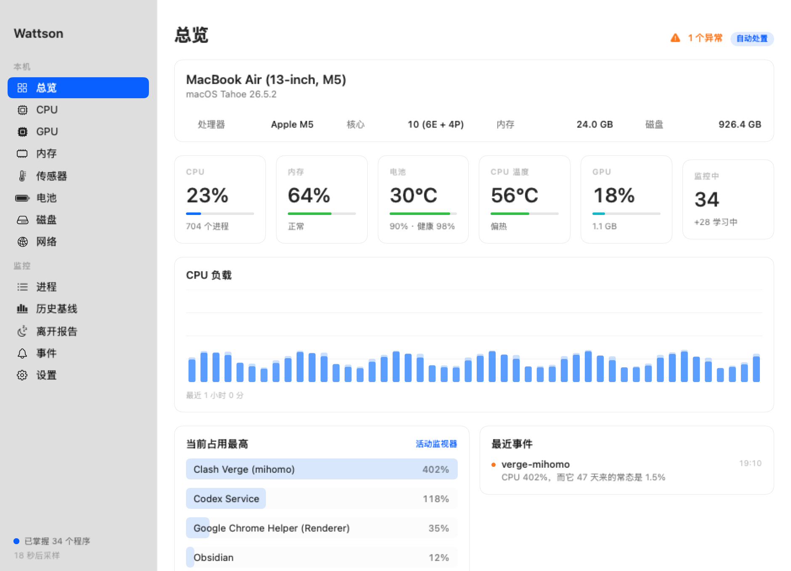
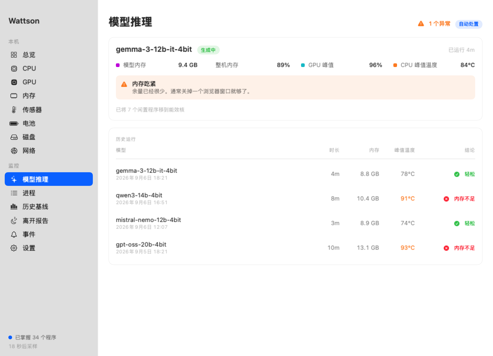
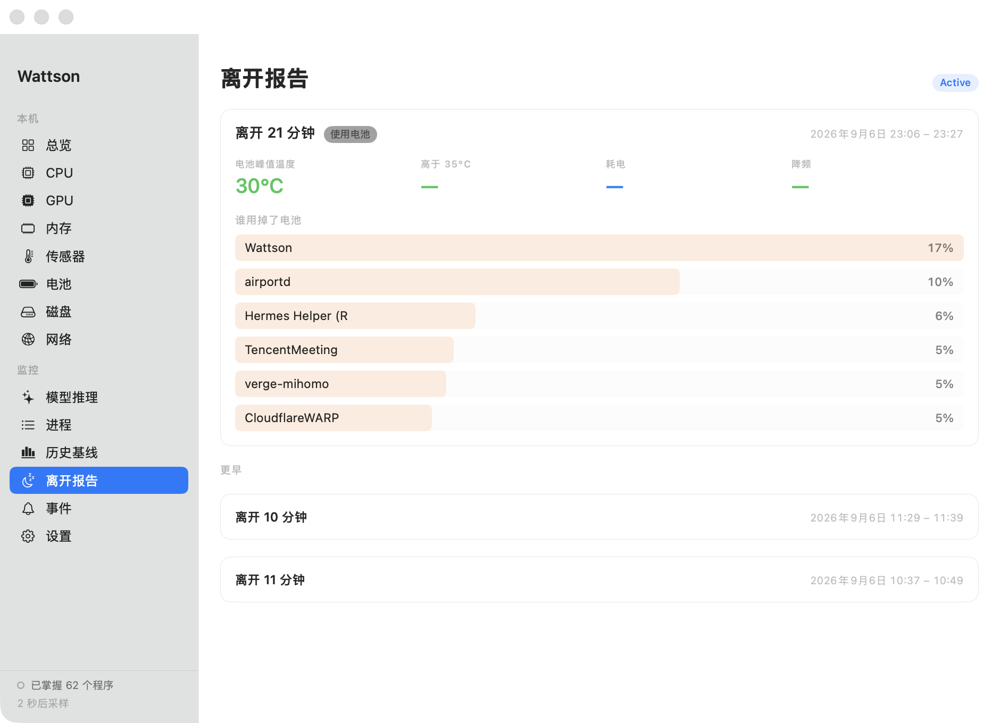
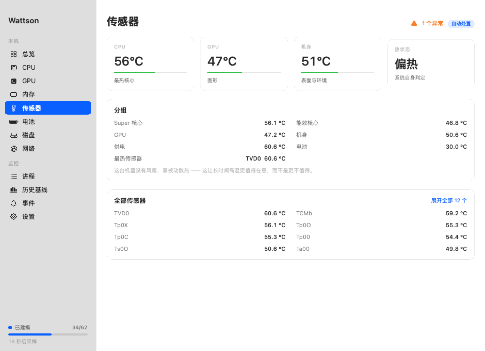
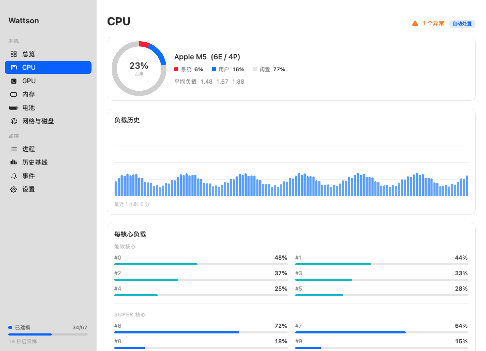
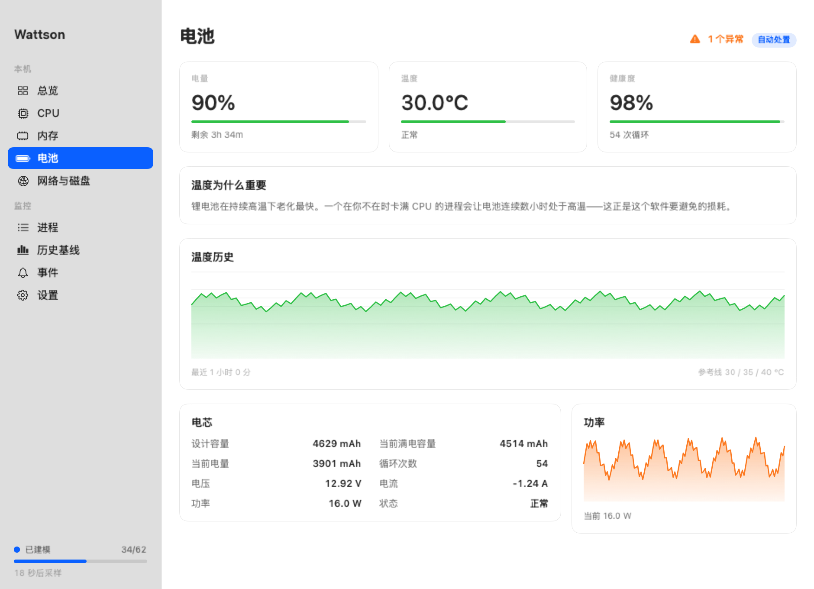
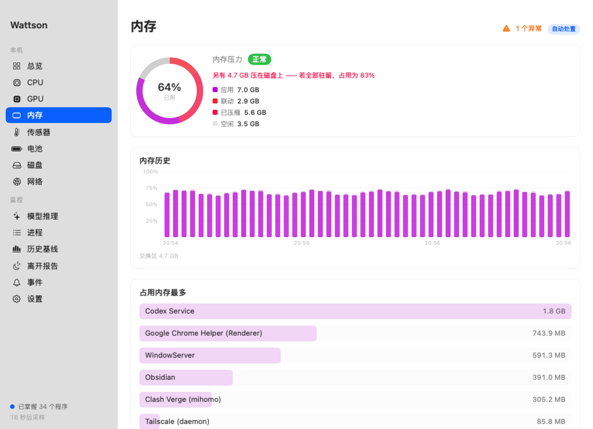
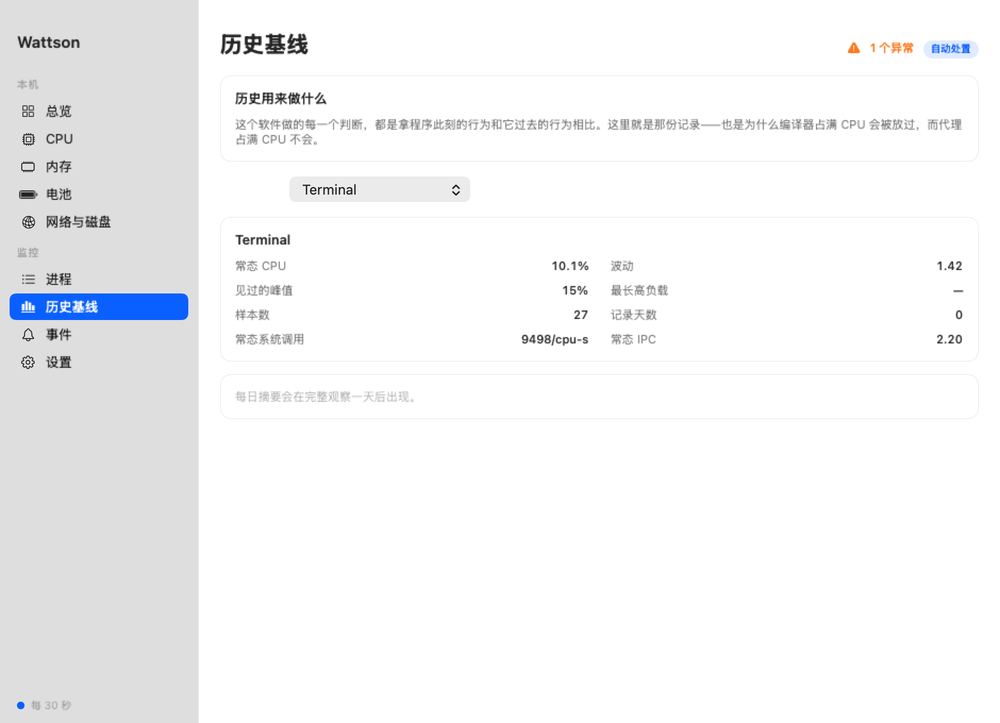

<p align="center">
  
</p>

<h1 align="center">Wattson</h1>

<p align="center">
  <b>一个会学习每个程序「正常」长什么样的 Mac 监控 —<br>
  以及一个在你不在时替你动手的守护。</b>
</p>

<p align="center">
  
  
  
  
  
</p>

<p align="center">
  <a href="README.md">English</a> · 简体中文
</p>

<p align="center">
  
</p>

---

## 为什么

所有进程监控都能告诉你谁最占 CPU。**没有一个能告诉你它「该不该」占。**

你让 Mac 挂着跑点长任务，回来发现它已经 90 度烧了九个小时——因为某个后台守护进程在上午十一点卡进了死循环。固定阈值抓不到这个，因为在一台真在干活的机器上，跑飞的和有用的长得一模一样：

<table>
<tr><td width="50%">

**正在编译的编译器**<br>
`100% CPU` · 别动它

</td><td width="50%">

**卡在 DNS 环路的代理**<br>
`100% CPU` · 从上午就坏了

</td></tr>
</table>

## 思路

> 不要问一个程序用了**多少** CPU。
> 要问**这个**程序以前**这样**用过 CPU 吗。

基线是**聚类的，不是平均的**——大多数程序有不止一种正常状态。编辑器空闲时接近零、编译时占满一核，单个中位数会落在两者中间的空档里，把两种真实状态都判成异常。在这台机器上，**45 个已建模的程序里有 43 个**被识别出多个正常状态。

| 程序的历史 | 今天看到 100% | 判定 |
|:---|:---|:---|
| 代理，一贯安静 | 完全不像它 | 🔴 **报警** |
| 浏览器，天生忽高忽低 | 见过一百次了 | ⚪ 忽略 |
| 渲染进程，一直满载 | 周二就这样 | ⚪ 忽略 |

记忆分两层——最近几小时的滚动窗口，加上**每个程序每天一条摘要、保留 90 天**。短窗口会被比它自己更长的异常拖上去，一个从昨天就卡住的进程会慢慢**变成**它自己的新常态。而这恰恰是你离家一周时最要命的失效方式。

---

## 为 agent 和本地模型而做

这是行为基线真正值回票价的地方，因为这类负载的失效方式和普通软件完全不同。

<table>
<tr>
<td width="45%"></td>
<td>

### 🧠 模型推理

从加载到退出全程跟踪——识别运行时和模型、从行为推断阶段、记录峰值内存、GPU、温度、降频和 swap。

历史运行会给**结论**：`轻松` · `有降频` · `内存不足`。

这一列回答的是你下载七个 GB 之前真正想知道的事，而且答案**来自你这台机器**，不是评测表。

</td>
</tr>
<tr>
<td></td>
<td>

### 🌙 离开报告

键盘安静下来时开始记录，你回来时结束：电池峰值温度、高于 35 °C 的分钟数、耗电量、降频，以及**整段时间按程序累计的能耗**。

瞬时能耗告诉你此刻谁贵，八小时累计告诉你**谁真的把电用掉了**。通常是两个不同的答案。

</td>
</tr>
<tr>
<td></td>
<td>

### 🌡 传感器

**116 个温度传感器**直接从 SMC 读取，按测量对象分组——性能核、能效核、GPU、机身、供电。

每组取**最热的那个**，因为决定系统何时降频的就是它。

</td>
</tr>
</table>

<details>
<summary><b>🧹 Agent 遗留</b> — agent 起了却没收拾的进程</summary>

<br>

你关掉一个程序，它就没了。但 agent 起的测试进程或 dev server **会活得比启动它的会话更久**，没有窗口可关，循环里也没有任何一环负责收拾。

进程通过**遍历进程树**认领——遗留下来的 `node` 本身说明不了什么，但它的祖先能。报告时点名：是什么、哪个 agent 留下的、遗留了多久，以及一个结束按钮。

保证这个判断诚实的关键：只算**已被 launchd 收养**的进程。还挂在活着的父进程下面的，已经有人负责了。

</details>

<details>
<summary><b>💾 腾内存</b> — 模型放不下时该关什么</summary>

<br>

把程序降到能效核**一个字节内存都释放不了**，而模型放不下时，内存恰恰是唯一重要的事。

用户态程序无法释放别人的内存——`purge` 要 root 且只清磁盘缓存，`memory_pressure` 是**分配**内存的测试工具而非回收，也没有任何 API 能让进程让出内存。**关掉它是唯一的办法。**

所以 Wattson 只做它能做的部分：哪些应用确实闲置、各自占了多少、关几个才够。按**拥有它们的应用**聚合，因为关掉浏览器的一个渲染进程毫无意义。

</details>

---

## 它能看什么

<table>
<tr>
<td width="50%"></td>
<td width="50%"></td>
</tr>
<tr>
<td>

**CPU** — 占用的用户/系统拆分、保留峰值的负载历史、能效核与性能核分开的每核心负载、来自 IOReport 的**每簇实时频率**、平均负载、启动时间。

</td>
<td>

**电池** — 电量、相对设计容量的健康度、循环次数、电压、电流、功率，以及**温度和它的历史曲线**。持续高温是电池老化的主因。

</td>
</tr>
<tr>
<td></td>
<td></td>
</tr>
<tr>
<td>

**内存** — 来自内核的真实压力等级，拆分为应用 / 联动 / 已压缩 / 空闲，交换区，以及占用最多的应用。

</td>
<td>

**历史基线** — 每个程序学到的行为：常态 CPU、波动、峰值、最长高负载、常态网络与系统调用速率，以及每天一根柱子并把当前值标在上面。

</td>
</tr>
</table>

全部来自系统自带的 `top`、`nettop`、`sysctl`、IO 注册表、SMC 和 IOReport。**无需 root，无需内核扩展，无需后台辅助进程。** 悬停任意图表可读出该列的均值、峰值和时间。

---

## 处置阶梯

从最温和的开始。

**1 · 移到能效核** — `taskpolicy -b`。M5 实测：

```
正常优先级        4381 Miter/s
taskpolicy -b      180 Miter/s     ← 慢 24 倍
taskpolicy -B     4367 Miter/s     ← 完全恢复
```

进程继续运行、连接不断、状态不丢，一旦恢复正常立刻还原。

**2 · 重启** — 只在降核几分钟仍未平息时执行，且每小时最多两次。

处置之前会对进程跑 `sample` 并保存调用栈。*「Clash 在你不在时占了很多 CPU」* 和 *「Clash 卡死在这个具体的调用上」* 之间的差别，是一份等你到家就不存在了的证据。

### 🛟 生命线

任何情况下都不碰：

- **系统关键进程** — 干预会让 macOS 降级甚至内核崩溃
- **你回家的路** — `sshd`、Tailscale、VNC、ToDesk、TeamViewer、AnyDesk、WireGuard、Cloudflare WARP

> 一个把你 VPN 挂起的守护进程，等于把你锁在了它本该保护的机器外面。

而且它**默认只观察**，也绝不处置还没建立基线的程序。

---

## 它刻意不做的事

它不判断一段计算是否「有用」。那是不可判定的，而且测量数据说得很直白——两个进程，一个在无限空循环，一个在做真实运算：

```
COMMAND              CPU%   SYSCALL/cpus    IPC
Python（空转死循环） 99.9              0   8.06
Python（真实运算）   99.9              0   8.22
```

无法区分，而且永远无法区分。Wattson 检测的是**行为突变**——不是「这活儿没意义」，而是「这程序不像它自己了」。

---

## 安装

```sh
git clone https://github.com/BabyChemZ/wattson
cd wattson
./scripts/build-app.sh
cp -r dist/Wattson.app /Applications/
open /Applications/Wattson.app
```

不需要 Xcode——SwiftPM 编译二进制，一个 shell 脚本组装 bundle。然后在设置里打开**登录时启动**。

<details>
<summary>下载的是打包好的版本？</summary>

<br>

构建未签名，下载的副本会被隔离：

```sh
xattr -dr com.apple.quarantine /Applications/Wattson.app
```

自己构建则完全不会有这个问题。

</details>

### 命令行

同一个二进制也是 CLI：

```sh
wattson top                    # 引擎眼中的所有进程
wattson status                 # 每个程序学到了什么
wattson explain verge-mihomo   # 某个程序基线的细节
wattson sensors                # 所有温度传感器
wattson watch                  # 前台运行守护
```

---

## 诚实的局限

- **事件很少，这是设计使然。** macOS 很稳定，一台正常的机器可能几周都不会有任何异常被标出。这是好结果，但也意味着守护本身更像保险；日常价值主要在监控、推理和 agent 这几块。
- **只在一台机器上测过** — M5 MacBook Air，24 GB，macOS 26。Intel 完全没测，部分功能在那上面不会工作。
- **未签名** — 公证需要付费开发者账号。
- **暂无自动化测试。**

---

<p align="center">
  <sub>MIT · 为一台经常独自运行的 Mac 而做。</sub>
</p>
